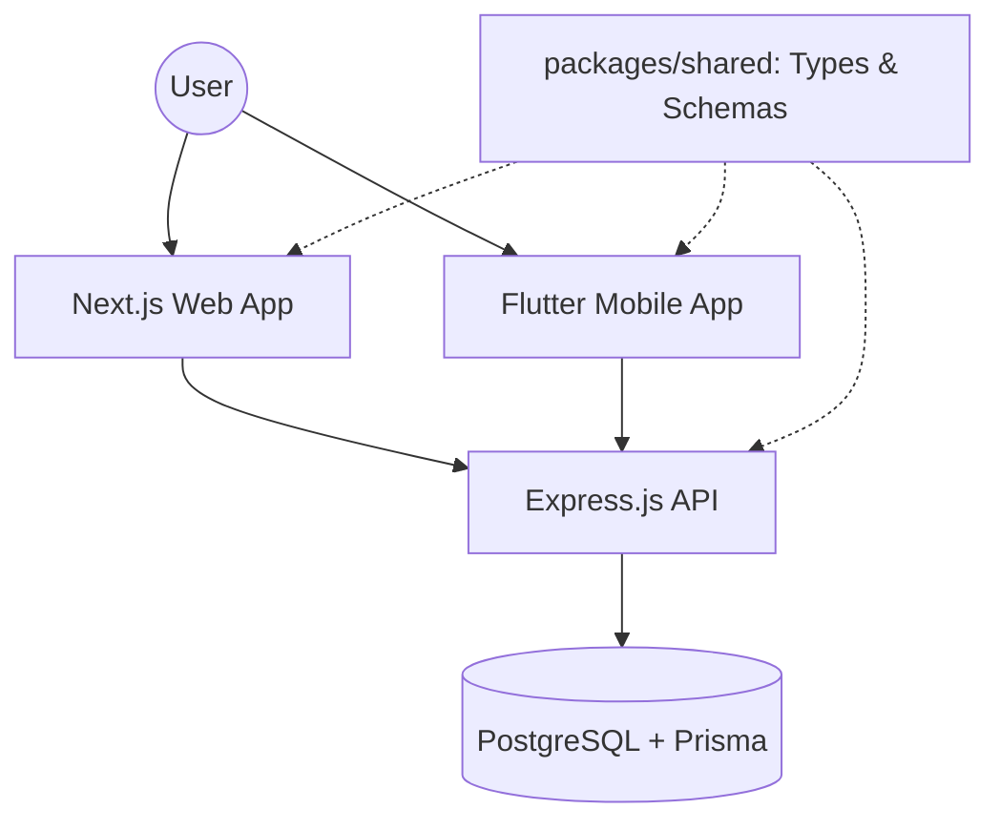

# Vezlock

Vezlock is an enterprise-grade, security-focused password manager designed with a **Zero-Knowledge** security model and a modern monorepo architecture. 

## 🛡️ Zero-Knowledge Security Model

Vezlock follows a strict Zero-Knowledge protocol. The server **never** sees or stores your Master Password or your raw, unencrypted data.

### Key Derivation & Authentication
When you log in, two distinct keys are derived from your Master Password on the client side:
1.  **Auth Key**: Sent to the server to verify your identity. The server stores a Bcrypt hash of this key (`user.authHash`).
2.  **Encryption Key**: Never leaves your device. It is used to encrypt and decrypt your vault entries locally.

### Data Storage
-   **Vault Entries**: Stored as AES-encrypted JSON blobs (`cipher`). 
-   **Salts**: The server stores a unique `vaultSalt` for each user, which is used to securely derive the Encryption Key on the client.

---

## 🏗️ System Architecture

The project uses a monorepo structure (managed by `pnpm workspaces`) to unify the entire ecosystem.



### Components
-   **`apps/backend`**: Express.js API handling authentication, synchronization, and user management.
-   **`apps/web`**: Next.js frontend for desktop and browser access.
-   **`apps/mobile`**: Flutter application for cross-platform mobile access.
-   **`packages/shared`**: Shared TypeScript types, Zod schemas, and utility functions used across all TypeScript packages.

---

## 🧪 Technology Stack

-   **Backend**: Express.js, Prisma ORM, Node.js
-   **Frontend**: Next.js, React, TailwindCSS (planned)
-   **Mobile**: Flutter, Dart
-   **Database**: PostgreSQL
-   **Language**: TypeScript (End-to-End for JS/TS apps)
-   **Package Manager**: pnpm

---

## 🔄 Core Workflows

### Vault Creation/Update
1.  User enters data (URL, Username, Password).
2.  The client encrypts the sensitive fields using the locally cached **Encryption Key**.
3.  The client sends the encrypted **cipher** and searchable metadata (e.g., title) to the backend.
4.  The server stores the opaque blob.

### Vault Retrieval
1.  User authenticates and fetches their encrypted records.
2.  The client decrypts the **cipher** strings on-the-fly using the **Encryption Key**.

---

## 🚀 Getting Started

### Prerequisites
-   Node.js (>= 18)
-   pnpm (>= 8)
-   Docker (for Database)

### Installation
```bash
git clone git@github.com:Asyqorrr/vezlock.git
cd envlock
pnpm install
```

### Development
```bash
# Start all applications in parallel
pnpm dev
```
