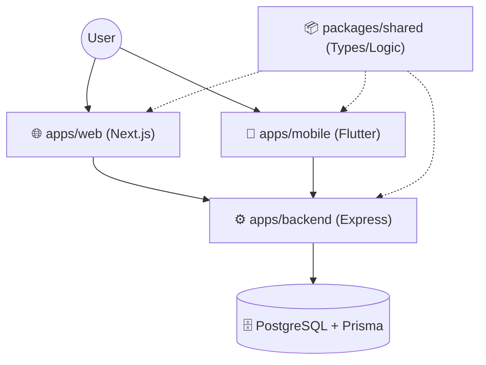

# 🛡️ Vezlock

Vezlock is an **enterprise-grade, security-first password manager** built on a solid foundation of **Zero-Knowledge** principles. It provides a secure, unified ecosystem for managing sensitive credentials across web and mobile platforms, ensuring that your data remains yours and yours alone.

---

## 🔒 Zero-Knowledge Security Model

Vezlock is designed with the philosophy that **privacy is a right, not a luxury**. Our security architecture ensures that the server acts only as an encrypted storage provider, never having access to your actual secrets.

### 🔑 Key Derivation & Client-Side Encryption
When you interact with Vezlock, all cryptographic operations occur exclusively on your device:

1.  **Identity Verification (Auth Key)**: A persistent key derived from your Master Password is used for authentication. The server only stores a non-reversible Bcrypt hash of this key.
2.  **End-to-End Encryption (Vault Key)**: A separate, unique encryption key is derived locally and never transmitted. This key encrypts your data before it ever leaves your browser or phone.

### 🛡️ Data Integrity
-   **AES-256 Encryption**: Vault entries are stored as opaque, encrypted JSON blobs.
-   **Unique Salts**: Every user has a unique server-side salt, preventing bulk attacks and ensuring high entropy for key derivation.

---

## 🏗️ System Architecture

Vezlock uses a modern **monorepo architecture** managed by `pnpm`, allowing for seamless synchronization between the backend, web, and mobile clients.



### Core Components
-   **`apps/backend`**: A robust Express.js API serving as the central synchronization hub. Managed with Prisma ORM for type-safe database interactions.
-   **`apps/web`**: A high-performance Next.js application designed for a sleek desktop experience.
-   **`apps/mobile`**: A cross-platform Flutter application providing secure access on the go (Development in progress).
-   **`packages/shared`**: The "source of truth"—shared TypeScript types, validation schemas (Zod), and utility functions used throughout the ecosystem.

---

## 🛠️ Technology Stack

| Layer | Technologies |
| :--- | :--- |
| **Backend** | Node.js, Express.js, Prisma ORM, Bcrypt |
| **Frontend** | React, Next.js, TypeScript |
| **Mobile** | Flutter, Dart |
| **Database** | PostgreSQL |
| **Validation** | Zod |
| **Monorepo** | pnpm |

---

## 🚀 Getting Started

### Prerequisites
-   **Node.js** (>= 18)
-   **pnpm** (>= 9)
-   **PostgreSQL** (Local instance or Docker)

### Installation
1.  **Clone the repository**:
    ```bash
    git clone https://github.com/Asyqorrr/vezlock.git
    cd vezlock
    ```

2.  **Install dependencies**:
    ```bash
    pnpm install
    ```

3.  **Environment Setup**:
    Configure your `.env` files in `apps/backend` (refer to `.env.example` if available).

### Development
Launch the entire ecosystem in development mode with a single command:
```bash
pnpm dev
```


## 📄 License
Vezlock is released under the [MIT License](LICENSE).
